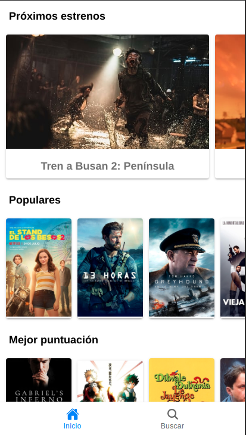
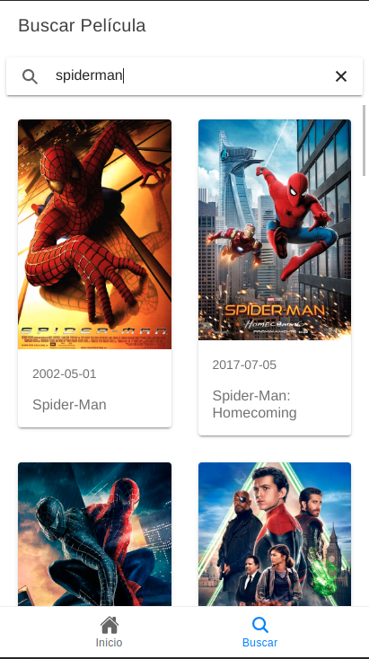

# Buscador de peliculas con ionic

_Aplicación realizada en ionic de consulta y búsqueda de películas, donde en una página inicial muestra las películas que se van a estrenar, las populares y las de mayor puntuación, al seleccionar una de estas accedemos a el detalle de la película.

Dispone también de una opcion de búsqueda donde realizar la búsqueda de películas y dados los resultados podremos acceder al detalle de las películas._


## Comenzando 🚀

_Para obtener una copia del proyecto en funcionamiento en tu máquina local, necesitaras descargarlo o clonar el repositorio a tu máquina._


### Tecnologías🛠️

Programas y Frameworks utilizados para el desarrollo y pruebas del proyecto:

* [VSCode] - Editor de código usado - (https://code.visualstudio.com/).
* [Ionic] - Framework de desarrollo.
* [GitHub] - Control de versiones.


### Instalación 🔧

Una vez descargado, descomprimido y ubicado en el directorio del proyecto, instale las dependencias.

```sh
$ npm install
```

Inicie el servidor

```sh
$ ionic serve
```

Las instrucciones sobre cómo usarlas en su propia aplicación están vinculadas a continuación.
GitHub  [plugins/github/README.md][PlGh] 


#### Código

Método en el servicio que nos trae las peliculas populares
```sh
getPopular() {

    return this.http.get<RespuestaMDB>(`${URL}/movie/popular?api_key=${apiKey}&language=es&page=1`);
  }
```


Método en el servicio que trae el detalle de uan pelicula
```sh
getMovieDetail( id: string ) {

    return this.http.get<PeliculaDetalle>(`${URL}/movie/${id}?api_key=${apiKey}&language=es`);
  }
```


Método en el servicio para realizar la búsqueda de peliculas
```sh
searchMovies( texto: string) {

    return this.http.get<RespuestaCredits>(`${URL}/search/movie?query=${texto}&api_key=${apiKey}&language=es&include_image_language=es`);
  }
```


Función para la busqueda de la pelicula 
```sh
buscar(event) {
    const valor: string = event.detail.value;

    if (valor.length === 0) {
      this.buscando = false;
      this.peliculas = [];
      return;
    }
    // console.log(valor);
    this.buscando = true;
    this.moviesService.searchMovies(valor)
      .subscribe( resp => {
        // tslint:disable-next-line:no-string-literal
        this.peliculas = resp['results'];
        this.buscando = false;
      });
  }
```


Fnción para ver el detalle de la pelicula
```sh
async verDetalle( id: string ) {
    const modal = await this.modalCtrl.create({
      component: DetalleComponent,
      componentProps: {
        id
      }
    });

    modal.present();
  }
```


Muestra las peliculas resultado de la búsqueda
```sh
<ion-grid>
    <ion-row> 
      <ion-col size="6" *ngFor="let pelicula of peliculas">

        <ion-card (click)="verDetalle(pelicula.id)">
          
          

          <ion-card-header>
            <ion-card-subtitle>{{ pelicula.release_date }}</ion-card-subtitle>
          </ion-card-header>

          <ion-card-content>
            <h2>{{ pelicula.title }}</h2>
          </ion-card-content>
        </ion-card>

      </ion-col>
    </ion-row>
  </ion-grid>
```

## Video

(https://www.youtube.com/watch?v=q00wMttq6JQ)

## Imagenes

Página principal


Buscador


Página detalle


## Wiki 📖

Puedes encontrar mucho más de cómo utilizar este proyecto en nuestra [Wiki](https://github.com/jocamo00/ionic_Buscador_de_Peliculas)

## Versionado 📌

Usamos [GitHub](https://github.com/) para el versionado. Para todas las versiones disponibles, mira los [tags en este repositorio](https://github.com/jocamo00/ionic_Buscador_de_Peliculas).

## Autor ✒️

* **Jose Carreres** - [jocamo00](https://github.com/jocamo00)


